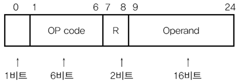
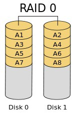
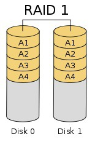
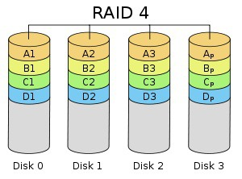
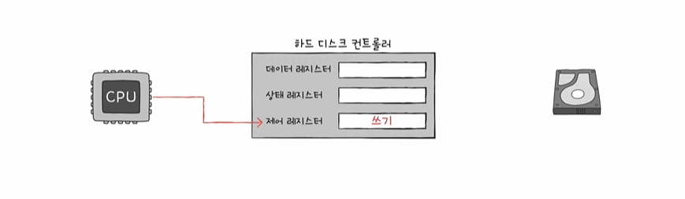
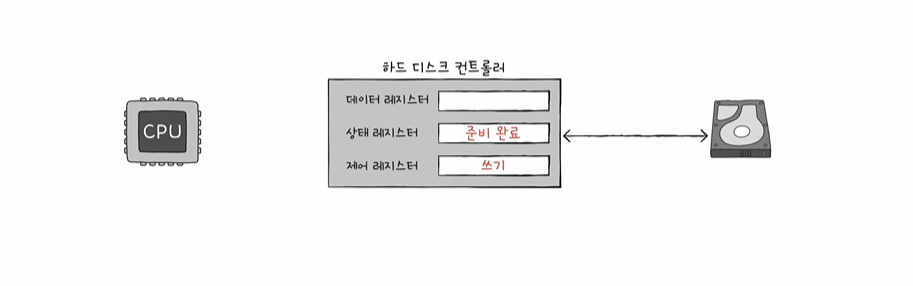
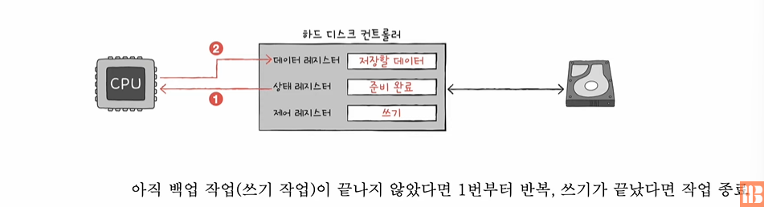
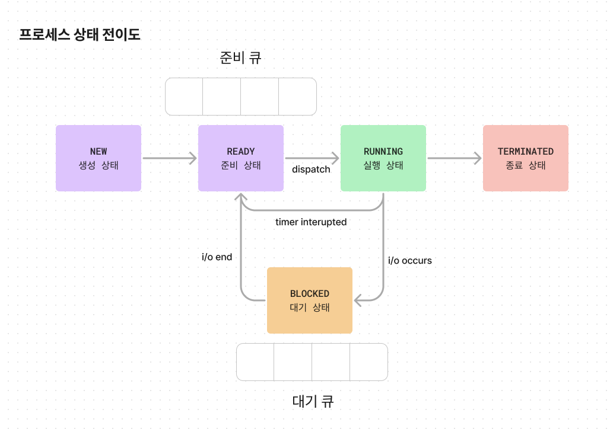

- 컴퓨터 구조
  - [명령어](#명령어)
  - [CPU](#cpu)
  - [CPU 성능 향상 방법](#cpu-성능-향상-방법)
  - [메모리](#메모리)
  - [보조기억장치](#보조-기억-장치)
  - [입출력장치](#입출력장치)
- [운영체제](#운영체제)
  - [프로세스](#프로세스)
  - [CPU 스케줄링](#cpu-스케줄링)
  - [프로세스 동기화](#프로세스-동기화)
  - [데드락](#교착상태dead-lock)
  - [가상 메모리](#가상-메모리)

# 명령어
## 명령어란?
- 명령어는 데이터를 연산하게 만드는 코드다.
## 명령어 분류
- 명령어는 저수준 언어와 고수준 언어로 분류된다.

### 저급 언어란?
- 컴퓨터 친화적인 명령어다.
- 기게어(bit로 이루어진 명령어)와 어셈블리어(기계어와 일대일 대응이 되는 명령어)로 이루어져있다.
### 고급 언어란?
- 인간 친화적인 명령어다.

## 컴파일러와 인터프리터
- 그렇다면 컴퓨터는 고급 언어를 어떻게 기계어로 이해할까?
- 정답은 컴파일러와 인터프리터다. 컴파일러와 인터프리터가 고급언어 코드를 번역한다.

### 컴파일러
- 컴파일러는 소스 코드를 한 번에 기계어로 번역한다. 이때 오브젝트 코드가 생성되는데, 오브젝트 코드는 하나의 실행 파일이 될 수 없기 때문에 따로 링킹(오브젝트 파일을 하나로 묶어서 파일을 만드는 작업)을 수행해야만 한다.

##### 장점
- 초기 스캔은 오래 걸리지만, 실행파일을 한 번 만들어 놓고 계속 사용하기 때문에 인터프리터보다 빠르다는 장점이 있다.
- 프로그램 실행 전에 오류를 발견할 수 있다.

##### 단점
- 초기 스캔이 오래 걸린다.
- 링킹 작업을 하기 때문에 인터프리터보다 메모리를 많이 사용한다.

### 인터프리터
- 소스 코드를 한줄씩 기계어로 번역한다.

##### 장점
- 소스 코드를 한줄씩 기계어로 번역하기 때문에 별도의 기계어 파일을 생성하지도 않고 링킹을 진행하지 않기 때문에 메모리 효율이 상대적으로 좋다.
- 빌드 과정 없이 실행이 가능하다.

##### 단점
- 한 문장씩 읽고 번역하기 때문에 실행 속도가 느리다.
- 한 문장씩 읽기 때문에 프로그램을 실행해야만 오류를 잡을 수 있다.

### 그렇다면 하나의 방식만 사용할까?
- 아니다. java도 JIT로 먼저 컴파일을 하여 속도를 줄이고 인터프리터를 이용하여 읽어들인다.

## 명령어 구조

- 명령어는 명령 코드와 오퍼랜드로 구분되어 있다.

### 명령코드(Operation Code)
- 명령어가 수행할 연산을 의마한다. 기본적인 명렁 코드는 4가지다.
- 데이터 전송, 산술/논리 연산, 제어 흐름 변경, 입출력 제어

### 오퍼랜드(Operand)
- 명령어가 연산에 수행할 데이터 혹은 데이터가 저장된 주소를 의마한다. 오퍼랜드 필드에는 데이터 또는 메모리나 레지스터 주소가 올 수 있다.
- 연산에 사용할 데이터 위치를 찾는, 주소 지정 방식
   - 즉시 주소 지정 방식(데이터)
   - 직접 주소 지정 방식(데이터 주소)
   - 간접 주소 지정 방식(유효 주소의 주소)
   - 레지스터 주소 지정 방식(데이터)
   - 레지스터 간접 주소 지정 방식(메모리의 주소가 레지스터에 저장)

* * *

# CPU
- ALU, 제어장치, 레지스터, 인터럽트에 대해서 이해하자

## ALU
- 레지스터를 통해 피연산자를 전달 받고 제어장치를 통해 해석된 연산을 전달받아, 결과를 레지스터에 저장하는 연산 장치다.
- ex) 1 + 2, 1과 2는 레지스터를 통해 전달받고 +는 제어장치를 통해 전달 받아 결과 3을 레지스터에 저장한다. (양수를 플래그에 등록한다.)

### 플래그 종류
- 부호 플래그 (1: 음수, 0:양수)
- 제로 플래그 (1: 0,   0:아님)
- 캐리 플래그 (1: 올림수, 발림수 0: 아님)
- 오버플로우 플래그 (1: 발생 0: 미발생)
- 인터럽트 플래그 (1: 인터럽트 가능 0: 불가능)
- 슈퍼바이저 플래그 (1: 커널모드 2:사용자모드)

## 제어장치
- 제어신호(write, read)를 내보내고 명령어를 해석하는 부품이다. 

### 제어장치가 받아들이고 내보내는 것들
##### 받아들이는 것 
- 제어장치는 클럭 신호를 받아들인다.
- 제어장치는 명령어 레지스터로부터 해석해야 할 명령어를 받아들인다.
- 제어장치는 플래그 레지스터 속 플래그 값을 받아들인다.
- 제어장치는 제어 신호를 받아들인다.
##### 내보내는 것
- 외부 : 제어신호를 메모리, 입출력장치로
- 내부 : 제어신호를 ALU, 레지스터로

## 레지스터
### 프로그램 카운터 (PC)
- 메모리에서 가져올 주소, 메모리에서 읽어들일 명령어의 주소를 저장하는 레지스터
- 명령어 포인터라고도 부른다.

### 명령어 레지스터
- 해석할 명령어를 저장하는 레지스터

### 메모리 주소 레지스터
- 메모리의 주소를 저장하는 레지스터
- 주소버스로 주소값을 내보낼 때 거친다.

### 메모리 버퍼(Or 데이터) 레지스터
- 메모리와 주고 받을 값을 저장하는 레지스터

### 범용 레지스터
- 데이터와 주소를 모두 저장할 수 있는 자유로운 레지스터

### 플래그 레지스터
- 연산 결과 또는 CPU의 부가정보를 저장하는 레지스터

#### 특정 레지스터를 이용한 주소 지정 방식
#### 스택 주소 지정 방식
- 스택과 스택 포인터를 이용한 주소 지정 방식
##### 스택 포인터
- 메모리의 스택 꼭대기를 지정하는 레지스
#### 변위 주소 지정 방식
- 오퍼랜드 필드 값과 레지스터 값을 더하여 유효주소를 얻어내는 방식
- 상대 주소 지정 방식 : 오퍼랜드 + PC = 유효주소
- 베이스 레지스터 주소 지정 방식 : 오퍼랜드 + 베이스 레지스터(기준 주소) = 유효주소

# 명령어 사이클과 인터럽트
- CPU가 명령어를 처리하는 것은 정형화된 흐름이 있다. 이를 명령어 사이클이라고 한다.
- 데이터를 인출하고 실행하는 과정을 기본적으로 거치나 간혹 흐름이 끊기는 경우가 있다. 바로 "인터럽트"다.
- 인출 사이클 - 실행 사이클 사이에 유효 주소의 주소를 얻어오는 과정(간접 사이클)이 필요하다.

## 인터럽트
- CPU가 수행 중인 작업이 방해를 받아 중지될 수 있는데 인터럽트가 발생한 경우다.
- 인터럽트는 크게 동기 인터럽트(예외)와 비동기 인터럽트(하드웨어 인터럽트)가 존재한다.
### 하드웨어 인터럽트
- 하드웨어 인터럽트는 입출력장치에 의해 발생하는 인터럽트다. 알림과 같은 역할을 한다.
- 예를 들어, 프린터에 출력을 명령했다고 가정하자. 인터럽트가 없다면 CPU는 프린트가 출력이 완료될 때까지 주기적으로 완료 여부를 확인해야만 한다. 이는 자원 낭비라 할 수 있다. 마치 알림이 없는 전자레인지 앞에서 조리가 끝날 때까지 기다리는 것과 같다. 하지만 하드웨어 인터럽트를 사용하면 출력이 완료되었을 때, CPU는 알람처럼 인터럽트를 통해 완료 여부를 확인할 수 있다.
#### 하드웨어 인터럽트 처리 과정
- 입출력장치는 CPU에 인터럽트를 요청한다.
- CPU는 실행 사이클이 끝나면 인터럽트 여부를 확인한다.
- CPU는 요청을 확인하고 인터럽트 플래그를 통해 처리 여부를 확인한다.
    - 물론 막을 수 없는 인터럽트도 있다. 정전이나 하드웨어 고장 등이 있다. 
- 인터럽트를 받아들일 수 있다면 CPU는 작업을 백업한다.
- CPU는 인터럽트 벡터(인터럽트 서비스 루틴 식별 정보)를 참조하여 인터럽트 서비스 루틴(=인터럽트 핸들러, 인터럽트를 처리하는 프로그램)을 실행한다.
- 루틴이 끝나면 백업된 작업을 처리한다.

### 동기 인터럽트(예외)의 종류
- 폴트 : 예외를 처리한 직후, 예외가 발생한 명령어부터 재실행하는 예외다.
  - 데이터가 메모리가 아니라, 보조기억장치에 있을 때 CPU는 폴트를 발생시키고 보조기억장로부터 필요한 데이터를 전달 받았을 때 다시 재개함
- 트랩 : 다음 명령어부터 실행을 재개하는 예외다.
  - ex) 디버깅
- 중단 : 프로그램을 강제로 중단 시켜야하는 오류가 발생했을 때
- 소프트웨어 인터럽트 : 시스템 호출이 발생했을 때

* * *

# CPU 성능 향상 방법
- 클럭, 코어, 쓰레드
- 파이프라이닝, 슈퍼스칼라, 비순차적 명령어 처리
- ISA, CISC, RISC

## 빠른 CPU를 위한 설계 기법

### 클럭
- [제어 장치가 받아들이는 것](#제어장치가-받아들이고-내보내는-것들)
- 클럭 속도가 높아질수록 CPU 명령어 싸이클이 빨라진다.
- 클럭 신호는 헤르츠(Hz) 단위로 측정한다.
- 클럭 속도는 일정하지 않으며 최대 클럭 속도로 끌어 올리는 행위를 오버클럭킹(overclocking)이라고 한다.
- 속도가 높으면 무조건 빠를까?
  - 빠른 속도는 발열 문제를 불러일으킨다.
  - 또한 클럭 속도로만 CPU의 속도를 증가시키는 건 한계가 있다.

### 코어
- 명렁어를 실행하는 부품이다.
- 코어가 발생한 다음부터, CPU의 정의를 흡수한다. 대신 CPU는 '명령어를 실행하는 부품의 집합'이 된다.
- 코어는 CPU의 부품인 ALU, 제어장치, 레지스터를 포함하고 있다. 코어가 8개라는 것은 이 부품들이 8개 포함되고 있다고 생각하면 된다.
- 코어를 여러개 포함하는 CPU를 멀티코어 프로세서라고 부른다.
- 코어가 많으면 무조건 빠를까?
  - 코어 수에 비례하여 증가하지 않는다. 업무가 균등하게 분배되어야 하기 때문이다.
  - 기억하자. 조별 과제를 4명이 한다고 4명만큼의 결과물이 발생하지 않는다.

### 스레드와 멀티스레드
- 하드웨어 스레드와 소프트웨어 스레드의 정의를 다르게 해야한다.
#### 하드웨어 스레드 
- 하나의 코어에서 처리하는 명령어 단위
- 하나의 코어로 여러개의 명령어를 처리하는 CPU를 멀티스레드 프로세서라고 한다.
- 하이퍼스레딩이라는 용어도 있다. 인텔의 멀티스레드 기술을 의미한다.

#### 소프트웨어 스레드
- 하나의 프로세스에서 독립적으로 실행되는 단위
  - 이때문에 1코어 1쓰레드 CPU로 여러 쓰레드로 만들어진 프로그램을 실행할 수 있다. 가 옳은 정의가 된다.

##### 멀티스레드 프로세서
- 멀티스레드 프로세서를 만드는 가장 큰 핵심은 **레지스터**다. 여러 명령어를 동시에 처리하려면 여러개의 레지스터를 가지고 있어야만 한다.
- 프로그램 입장에서 봤을 때 코어는 하나이지만 CPU가 여러개 있는 걸로 보인다. 그때문에 **논리 프로세서**라고 부르기도 한다.

## 명령어 병렬 처리 기법

### 파이프라인
- 명령어들을 명령어 파이프라인에 넣고 동시에 처리하는 기법이다.
- 하지만 파이프라인 위험을 가질 수 있다.

#### 파이프라인 위험
- 데이터 위험 : **데이터 의존성**에 의해 발생한다.
- 제어 위험 : **프로그램 카운터**의 갑작스러운 변화에 의해 발생한다.
- 구조적 위험 : 다른 명령어가 동시에 ALU, 레지스터 등과 같은 **CPU 부품을 사용할 때 발생**한다. **자원 위험**이라고도 부른다.

### 슈퍼스칼라
- CPU 내부에 여러개의 명령어 파이프라인을 포함한 구조다.
- 클럭 주기마다 여러개의 명령어를 인출할 수도, 실행할 수도 있다. 하지만 파이프라인 위험을 피하기가 더 까다롭다.

### 비순차적 명령어 처리
- 순차적으로 실행하지 않는 기법이다.
- 프로그램을 위에서 아래로 차례차례 실행하지 않고 순서를 바꿔도 무방한 명렁어를 먼저 실행하는 기법이다.

## CISC와 RISC

### ISA
- CPU가 이해하는 명령어 집합
- CPU마다 ISA가 다르기 때문에 같은 실행파일을 실행할 수 없다.
- 파이프라이닝 되기 쉬운 명령어 집합도 있고 그렇지 못한 명령어 집합도 있다.

### CISC
- **가변 길이 명령어**를 사용한다.
- 적은 수의 명령어로도 실행할 수 있기 때문에 메모리 공간을 절약할 수 있다.
- 명령어의 크기와 클럭 주기가 제각각이다. 그렇기 때문에 파이프라이닝이 어렵다.

### RISC
- 고정 길이 명령어를 사용한다.
- 명령어의 크기는 동일하고 클럭 주기는 1클럭로 실행된다. 그렇기 때문에 파이프라이닝에 최적화되어 있다.
- 하지만 레지스터를 이용하는 연산이 많고 레지스터 개수도 더 많다.
- 더 많은 명령으로 프로그램을 작동하기 때문에 메모리 공간을 상대적으로 더 사용한다.

* * *

# 메모리
- 메모리 특징, 성능과의 연관성, 메모리 종류
- 물리주소와 논리주소
- 캐시 메모리

## 메모리에 대해서
### 메모리 특징
- 실행되는 프로그램의 저장 공간이며 휘발성 특징을 가지고 있다.

### 메모리는 클수록 좋은가?
- 우선 메모리가 클수록 보조기억장치에 접근 빈도가 낮아지기 때문에 성능이 향상된다.
- 하지만 메모리는 저장 공간이기 때문에 메모리 공간에 비례해서 증가하지 않고 한계가 존재한다.

### 메모리 종류
#### DRAM(Dynamic RAM)
- 시간이 지날수록 데이터가 사라지는 메모리다.
- 집적성이 좋고 사용전력이 낮으며 비용이 저렴한 장점이 있다.
- 데이터의 소멸을 막기 위해 주기로 데이터를 재활성 해야만 한다.

#### SRAM(Static RAM)
- 시간이 지나도 데이터가 사라지지 않는 메모리다. (하지만 휘발성임)
- 집적성이 나쁘고 사용전력이 높으며 비용이 비싸다는 장점이 있다.
- 속도가 빠르기 때문에 캐시 메모리에서 사용된다.

#### SDRAM(Synchronous Dynamic RAM)
- 클럭 신호에 동기화된 RAM이다.
- 클럭 신호에 맞춰 CPU와 정보를 주고 받을 수 있는 DRAM이다.

#### DDR SDRAM(Double Data Rate RAM)
- 대역폭(데이터를 주고 받는 길의 너비)을 넓혀 속도를 빠르게 만든 SDRAM이다.
- SDRAM에 비해 2배 가량 빠르다.

## 물리 주소와 논리 주소
- 메모리가 사용하는 **물리 주소**와 CPU와 프로그램이 사용하는 **논리 주소**
- 예를 들어, 메모리에 카카오톡과 메모장 프로그램이 적재되어 있을 때 프로그램들은 메모리 몇번지에 저장되어 있는지 알 필요가 없다. **새로운 프로그램이 언제든 적재될 수 있고, 실행되지 않는 프로그램은 언제든 메모리에서 삭제**될 수 있기 때문이다.
- 그래서 0번지부터 시작하는 자신만의 논리 주소를 가지고 있다. 

### 메모리 관리 장치(MMU)
- 그렇다면 어떻게 카카오톡의 0번지와 메모장의 0번지를 구분할 수 있을까?
- CPU가 받아들이는 정보가 논리주소라고 해도 메모리와 상호작용 하기 위해서는 논리주소를 물리주소로 연산하는 과정이 필요하다.
- 논리주소를 물리주소로 연산해주는 장치가 메모리 관리 장치(MMU)다.
- CPU 내부에 삽입되어 있다.

#### 물리주소를 연산하는 방법
[레지스터](#레지스터)
- 베이스 레지스터, 논리주소가 필요하다.
- 베이스 레지스터는 기준 주소라고 말했다. 이를 재정의해보자.
- 베이스 레지스터는 프로그램의 첫 물리 주소가 저장되는 공간이다.
```
(베이스 레지스터 + 논리 주소) = 물리 주소
```

#### 메모리를 보호하는 방법
- 한계 레지스터로 실행 중인 프로그램의 메모리를 보호한다.
- 논리주소의 최대값을 저장하는 레지스터로 요청된 논리주소가 한계 레지스터보다 크면 **인터럽트**가 발생한다.

## 캐시 메모리
### 저장 장치 계층 구조
- 캐시 메모리의 등장 배경을 이해하기 위해서는 저장 장치 계층 구조(memory hierarchy)의 이해가 필요하다.
- CPU에서 얼마나 가까운가를 계층적으로 표현한 것


출처 - https://www.geeksforgeeks.org/memory-hierarchy-design-and-its-characteristics/
- CPU와 가까운 저장 장치는 빠르고 멀리 있는 저장 장치는 느리다.
- 속도가 빠른 저장 장치는 용량이 작고 가격이 비싸다.

### 캐시 메모리
- CPU와 메모리 사이에 위치하고, 레지스터보다는 저장 공간이 크고 메모리 보다는 빠른 SRAM 기반의 저장 장치다.

### 캐시 메모리에 저장되는 것
- 캐시 메모리에는 메모리의 일부가 저장된다.
- CPU에서 사용할 법한 대상을 예측해서 저장해야 한다. 이때 나오는 개념이 캐시 히트, 캐시 미스, 캐시 적중률이다.
  - 캐시 히트 : 메모리 내 데이터를 CPU에서 활용하는 경우
  - 캐시 미스 : 메모리 내 데이터를 CPU에서 활용하지 않은 경우
  - 캐시 적중률 : 캐시 히트의 비율

### 참조 지역성의 원리
- CPU에 활용될법한 대상을 어떻게 알까?
- 바로 참조 지역성의 원리를 기반으로 저장할 데이터를 결정한다.
  - 시간 지역성 : CPU에서 최근에 접근했던 메모리 공간에 다시 접근하는 경향이 있다.
  - 공간 지역성 : CPU는 접근한 공간의 주변 메모리에 접근하려는 경향이 있다.

* * *
# 보조 기억 장치
- 크게 하드디스크와 플래시 메모리가 존재한다.

## 하드디스크
- 자기적인 방식으로 데이터를 저장하는 보조기억장치이다. 이때문에 하드 디스크를 자기 디스크의 일종으로 지칭하기도 한다.

### 하드디스크의 구성
- 플래터 : 하드디스크의 원판. 플래터는 자기 물질로 덮여 있어 수많은 N극과 S극을 저장한다. 저장된 N극과 S극은 0과 1의 역할을 수행한다.
- 스핀들 : 플래터를 회전시키는 구성 요소. 스핀들이 플래터를 돌리는 속도는 분당 회전수를 나타내는 RPM 단위로 표현한다.
- 액추에이터 : 헤드와 암으로 구성된 플래터를 읽기 위한 부품
- 헤드 : 플래터 위에서 데이터를 읽고 쓰는 부품
- 암 : 원하는 위치로 헤드를 이동시키는 부품

### 하드디스크에 저장되는 기준
- 트랙 : 플래터의 동심원 하나
- 섹터 : 하드 디스크의 가장 작은 전송 단위, 트랙을 여러 조각으로 나눌 때 갭과 갭(섹터를 구분하기 위한 간격)의 사이 공간
- 실린더 : 여러개의 플래터에 같은 위치를 한 트랙들의 집합

### 하드 디스크가 저장된 데이터에 접근하는 시간
- 탐색 시간 : 접근하려는 데이터가 저장된 섹터까지 헤드를 이동시키는 시간
- 회전 지연 : 헤드가 있는 곳으로 플래터를 회전시키는 시간
- 전송 시간 : 하드 디스크와 컴퓨터 간에 데이터를 전송하는 시간

## 플래시 메모리
- 전기적으로 데이터를 저장하는 반도체 기반 저장 장치

### 저장 기준
- 셀 : 플래시 메모리에서 데이터를 저장하는 가장 작은 단위
- 셀 -> 페이징 -> 블록 -> 플레인 -> 다이 순으로 단위가 커진다.

### 플래시 메모리 종류
- 한 셀에 몇 비트를 저장할 수 있냐로 나뉨
- SLC : 한 셀에 1비트를 저장할 수 있는 플래시 메모리. 속도가 빠르고 수명이 기나 가격이 비싸다.
- MLC : 한 셀에 2비트를 저장할 수 있는 플래시 메모리, 속도가 느리나 대용량화하기 쉽고 가격이 저렴하다.
- TLC : 한 셀에 3비트를 저장할 수 있는 플래시 메모리, 속도가 더 느리나 대용량화하기 더 쉽고 가격이 더 저렴하다.

### 읽고 쓰는 기준인 페이징
- 저장 기준과 읽고 쓰는 기준이 다른 것이 플래시 메모리의 특징이다. 삭제 기준은 블록이다.
- 페이지는 세가지 상태를 가질 수 있다.
  - free : 새로운 데이터를 저장할 수 있는 상태
  - valid : 유효한 데이터를 저장하고 있는 상태
  - invalid : 유효하지 않은 데이터를 저장하는 상태
- 그럼 유효하지 않은 데이터를 유지하면 불필요한 용량을 차지할텐데 어떻게 해야 할까?
  - 답은 가비지 컬렉션 기능이다. SSD는 가비지 컬렉션 기능을 제공한다.

#### 가비지 컬렉션 흐름
1. 유효한 페이지를 새로운 블록으로 복사한다.
2. 기존의 블록을 삭제한다.

## RAID의 정의와 종류
- 용량이 큰 하나의 하드디스크를 사용하는 것이 좋을까, 여러개의 하드디스크를 사용하는 것이 좋을까?
- 여러개의 하드디스크를 RAID로 구성하면 속도가 증가하고 안전성을 가질 수 있게 된다.

### RAID 장점
- 디스크 I/O 병렬화로 인한 성능 향상
- 데이터 복제로 인한 안정성 향상 

### RAID(Redundant Array of Inexpensive Disks)
- 여러개의 물리적 보조기억장치를 마치 하나의 논리적 보조기억장치처럼 사용하는 기술을 의미한다.

### RAID의 종류
- RAID0 : 여러개의 하드디스크에 데이터를 스트라이핑한다. 저장된 데이터는 스트라입이라 한다.
- 
- RAID1 : 복사본을 만드는 방식이다. 거울처럼 완전한 복사본을 만드는 방식을 미러링이라 한다. 복구가 매우 간단하나, 복사본때문에 용량이 줄어들어 비용이 많이 드는 단점이 있다. 속도도 0에 비해 저하된다.
- 
- RAID4 : 완전한 복사본을 만드는 대신 오류를 검출하고 복구하기 위한 정보인 패리티 비트를 저장한다.
- 
- RAID5 : RAID4의 문제점인 병목현상을 제거하기 위해 패리티 비트를 분산 저장한다.
- 
- RAID6 : RAID5와 구성이 같으나 서로 다른 패리티 비트를 저장한다. 쓰기 속도는 저하되나 더 안전한다.
- 

* * *
# 입출력장치
- 컴퓨터와 보조 기억 장치가 연결되고 송수신 하기 위해서는 **장치 컨트롤러**와 **장치 드라이버**를 이해해야 한다.
- 입출력 장치는 다루기 까다롭다. 왜냐하면?
  - 1. 입출력 장치가 **너무 많다.**
  - 2. CPU와 메모리의 전송률은 높지만 **입출력장치의 데이터 전송률**(데이터를 얼마나 빠르게 전송할 수 있는지 지표를 나타낸다)은 낮다.

## 장치 컨트롤러와 장치 드라이버
### 장치 컨트롤러
- 입출력장치의 작은 CPU다.
- 입출력장치와 컴퓨터와의 **전송률을 해결**하기 위해 존재하는 장치 컨트롤러다. 입출력 제어기, 입출력 모듈이라고도 불린다.

### 장치 컨트롤러의 역할
- **CPU와 입출력장치 간의 통신**
- **오류 검출** : 장치 컨트롤러는 자신과 연결된 입출력장치에 문제 없는지 오류를 검출하기도 한다.
- **데이터 버퍼링** : 버퍼라는 임시 저장 공간에 저장하여 전송률을 비슷하게 맞추는 기술이다.

### 장치 컨트롤러의 구조
- **데이터 레지스터** : 버퍼의 역할
- **상태 레지스터** : 입출력 작업 준비, 입출력 작업 완료 여부, 입출력장치 오류 검증 정보를 저장하는 레지스터
- **제어 레지스터** : 수행할 내용에 대한 제어 정보를 저장한다.

## 장치 드라이버
- 컴퓨터에 연결하려면 장치 드라이버를 다운로드 받아야만 한다.
- 장치 컨트롤러의 동작을 감지하고 제어하여 장치 컨트롤러가 컴퓨터와 정보를 주고 받을 수 있게 만드는 소프트웨어다.

## 다양한 입출력 방법
- **프로그램 입출력, 인터럽트 기반 입출력, DMA 입출력 방식**이 존재한다.

### 프로그램 입출력
- CPU가 프로그램 속 명령어를 실행할 때 입출력 명령어를 만나면 입출력 작업을 수행한다.

#### 과정




**그렇다면 CPU는 어떻게 수많은 입출력 장치의 주소를 알고 있는걸까?**
- 크게 두가지 방법이 있다.

#### 메모리 앱 입출력
- 메모리에 접근하는 주소 공간과 입출력 장치에 접근하는 주소 공간을 **하나의 공간**으로 간주하는 방법이다.
- 즉, 1024개의 주소 공간이 있을 때 512개를 메모리 주소 공간에 남은 512개를 입출력 주소를 표현한다.
- 메모리 공간이 줄어들지만, 메모리와 입출력장치에 같은 명령어 사용이 가능하다.

#### 고립형 입출력
- 메모리를 위한 주소 공간과 입출력 장치를 위한 주소 공간을 **분리하는 방법**이다.
- CPU가 메모리 읽기/쓰기 선을 활성화하면 메모리 주소를 읽고, 입출력 읽기/쓰기 선을 활성화하면 입출력 주소를 읽는다.
- 메모리 공간은 유지되지만, 입출력 전용 명령어를 사용한다.

### 인터럽트 기반 입출
- 장치 컨트롤러가 입출력 작업을 끝낸 뒤 CPU에게 입출력 신호를 보내면 CPU는 하던 일을 백업하고 인터럽트 서비스 루틴을 실행한다.
- 인터럽트와 자주 비교되는 개념 중 **폴링**이 존재한다.

#### 그렇다면 입출력 장치가 많은 상황이면 어떡할까?
- 순차대로 **인터럽트**를 수행한다.
- 플래그 레지스터 속 인터럽트 비트가 활성화 되어 있거나, **비활성화되어 있어도 무시할 수 없는 인터럽트인 NMI**(non-maskable interrupt)가 발생하면 우선순위가 높은 인터럽트부터 처리한다.
- 우선순위를 반영하여 인터럽트를 처리할 때, 많은 컴퓨터에서는 **PIC(프로그래머블 인터럽트 컨트롤러)라는 하드웨어**를 사용한다.
- PIC는 인터럽트를 판별한 후, CPU에 지금 처리해야 할 하드웨어 인터럽트를 알려주는 장치다.

### DMA 입출력
- 프로그램 입출력과 인터럽트 기반 입출력은 입출력장치와 메모리 간의 데이터 이동은 CPU가 주도하고 이동하는 데이터도 CPU를 거친다는 점이다.
- 입출력 장치와 메모리 사이에 전송되는 데이터가 모두 CPU를 거친다면 CPU는 시간을 뺏기게 된다.
- 그래서 입출력장치와 메모리가 CPU를 거치지 않고 상호작용할 수 있는 입출력 방식인 **DMA**가 등장한다.
- DMA 입출력을 하기 위해선 시스템 버스에 연결된 **DMA 컨트롤러**라는 하드웨어가 필요하다.

#### 하지만 시스템 버스는 동시에 사용이 불가하다.
- 시스템 버스는 공유 자원이기 때문에 동시에 사용이 불가능하다. 그래서 DMA는 CPU가 사용하지 않거나, CPU에 허락을 구하여 시스템 버스를 사용한다.

#### 사이클 스틸링
- CPU 입장에서는 버스에 접근하는 주기를 도둑 맞은 기분이 들기 때문이 이러한 DMA의 시스템 버스 이용을 **사이클 스틸링**이라 한다.

### 입출력 버스
- 시스템 버스의 문제를 **DMA 컨트롤러와 장치 컨트롤러**들을 입출력 버스라는 별도의 버스에 연결하여 해결한다.

# 운영체제

* * *
# 프로세스
- **프로세스란?** 메모리에 적재되어 실행 중인 프로그램을 의미한다.
- 프로세스의 중요한 개념 중 하나는 **context(문맥)**이다.

## 컨텍스트와 컨텍스트 스위칭
### 컨텍스트(문맥)
- 컨텍스트란 프로세스가 현재 어떤 상태에서 수행되고 있는지 규명하기 위해 필요한 정보이다.
- 중간 어느 시점을 잘라 놓고 봤을 때, 이 프로그램의 무엇을 어떻게 실행하고 어디까지 수행했는지 알려준다.
#### 컨텍스트의 구조
- **하드웨어 문맥**
  - PC
  - registers 
- **프로세스 주소 공간**
  - code, data, stack
**- 프로세스 관련 커널 자료 구조**
  - PCB
  - kernel stack

### 컨텍스트 스위치
- CPU 제어권이 하나의 프로세스에서 다른 프로세스로 넘겨주는 과정을 의미한다.

#### 컨텍스트 스위칭 과정
- 수행하고 있던 프로세스의 정보를 PCB에 저장한다.
- 이후, 수행하려는 프로세스의 정보를 PCB에서 읽어온다.
- 이렇게 현재 CPU가 어디까지 실행했는지 정보를 PCB에 저장하고 다시 실행할 때, PCB를 통해 가져온다. 그래야만 다음 실행 시에 프로세스가 이전에 작업했던 곳에서 재시작할 수 있다.

#### 컨텍스트 스위칭이냐? 아니냐?
- System call이나 interrupt 발생 시 반드시 컨텍스트 스위치가 일어나는 것은 아니다.
- 컨텍스트 스위치가 아닌 경우 : A 프로세스 -> 커널 모드 -> **A 프로세스**
- 컨텍스트 스위치가 맞는 경우 : A 프로세스 -> 커널 모드 -> **B 프로세스**
- 모드 변경 시, PCB에 일부가 저장되는 것은 맞지만 컨텍스트 스위치 시 더 많은 오버헤드가 발생한다.

## 프로세스 상태
- 크게 **ready, running, waiting**으로 나뉜다. 외에 **new, terminated**도 존재한다.
- ready : 메모리는 적재되었으나 CPU를 얻지 못한 프로세스 상태
- running : 메모리에 적재되었고 CPU를 얻어 인스트럭션을 실행 중인 상태
- waiting : 메모리에 적재되었으나 CPU를 얻어도 실행할 수 없고 **i/o 등의 event를 기다리는 상태** ex) 입출력 요청 시 waiting
- new : 프로세스를 위한 자료구조는 생성되었으나 **메모리 획득을 승인(amitted)** 받지 못한 상태
- terminated : 프로세스가 종료되었으나 운영체제가 자료구조를 완전히 정리하지 못한 상태
- 중기 스케줄링이 생기면서 **suspended**라는 상태가 추가되었다.
- suspended : 외부 이유로 프로세스 수행이 정지된 상태
 
## 스케줄링
- 프로세스에 어떤 자원을 할당할지 결정하는 커널의 코드
### 단기, 중기, 장기 스케줄링
- **단기 스케줄링** : 운영체제가 프로세스에게 CPU를 할당해주는 문제 (ready -> running)
- **중기 스케줄링** : 운영체제가 프로세스에게 메모리를 뺏어오는 문제 (ready, waiting -> suspended)
- **장기 스케줄링** : 운영체제가 프로세스에게 메모리를 할당할지 결정하는 문제 (new -> ready)

### 장기 스케줄링 (job scheduler)
- 시작 프로세스 중에 어떤 것을 ready queue로 보낼지 결정한다. (new->ready)
- 현대 OS에서는 잘 사용하지 않는다. 대신 중기 스케줄링이 대체했다.
- degree of multiprogramming(멀티 프로그래밍 정도)를 제어한다.

### 중기 스케줄링 (swapper)
- 프로세스를 통째로 메모리에서 디스크로 쫓아낸다. (스왑아웃) 그렇기 때문에 swapper라고도 한다.
- 현대 OS에서는 장기 스케줄링 대신에 사용된다. 그렇기 때문에 처음에 모든 프로세스가 올라오고 중기 스케줄링으로 프로세스를 스왑 아웃한다.
- 중기 스케줄링의 특징은 **프로세스의 suspended 상태**가 추가되었다는 것이다. 외부에 의해 프로세스 수행이 정지된 상태로, 중기 스케줄링에 의한 스왑 아웃도 해당한다.

#### 어떤 프로세스가 스왑아웃 될까?
- 0순위는 waiting하고 있는 프로세스
- 다음 순위는 ready 중인 프로세스

### 단기 스케줄링 (CPU scheduler)
- 어떤 프로세스를 다음에 running 할지 결정한다.
- 타이머 인터럽트가 걸릴 때마다 단기 스케줄링이 실행된다고 보면 된다.

## PCB(Process Control Block)
- **운영체제가** 프로세스들을 관리하기 위해 **프로세스마다 유지하는 정보들**을 담는 **커널 내의 자료구조**를 의미한다. 메모리의 커널 영역의 스택에 위치한다.

### PCB 구조
- 운영체제가 관리상 사용하는 정보
  - 프로세스의 상태, 번호, 스케줄링 정보, 우선순위
- CPU 수행 관련 하드웨어값
  - PC, registers
- 메모리 관련
  - 코드, 데이터, 스택의 위치 정보
- 파일 관련
  - 프로세스가 오픈한 파일 정보

## 프로세스의 생성과 종료
### 프로세스 생성
- 프로세스를 생성하는 것은 부모 프로세스를 자식 프로세스로 복제 생성하는 방식이다.
- 프로세스는 자원을 필요로 하는데, 이때 두가지로 나뉜다.
  - 운영체제로부터 자원을 받는 방법 (일반적인 프로세스다)
  - 부모 프로세스와 일부를 공유하는 방법
  - 부모 프로세스와 공유하는 방법
- 프로세스를 수행하는 방법 역시 두가지로 나뉜다
  - 부모와 자식이 공존하며 수행되는 모델
  - 자식이 종료(terminated)될 때까지 부모다 기다리는(wait) 모델이다
- 프로세스의 주소 공간
  - 자식은 부모의 공간을 복사(fork)하고 그 공간에 새로운 프로그램(exec)을 올릴 수 있다.

### copy on write(쓰기 시 복사)
- copy on write는 **격리와 지연**이 핵심이다. 부모 프로세스로부터 주소 공간을 복사하면 메모리에는 같은 주소 공간이 두개 적재된다. 이는 **메모리의 효율성을 저해**하기 때문에 공유할 수 있는 것들은 공유한 뒤, 두 프로세스 중 어느 하나라도 변경이 되면 부모와 공유하던 것을 카피한다.

### 프로세스 종료
- 자발적 종료와 비자발적 종료가 존재한다.
- 자발적 종료 : 코드 상에 exit() 시스템 콜이 있거나 없으면 컴파일러가 main 함수의 마지막에 exit() 코드를 삽입한다. 종료되면 프로세스의 각종 자원들이 운영체제에게 반납된다.
  - 프로세스가 종료될 때 자식이 부모에게 output data를 보낸다.
- 비자발적 종료 : 부모 프로세스가 자식의 수행을 종료시킨다 (abort)
  - 자식 프로세스가 **할당된 자원의 한계치**를 넘어설 때
  - 자식에게 할당된 **태스크가 더 이상 필요하지 않을** 때
  - **부모가 종료(exit)**하는 경우 단계적 종료를 할 때
- 자식 프로세스가 먼저 죽고 부모 프로세스가 죽는다.
- 프로세스 세게예서는 자식이 먼저 죽고 이에 대한 처리는 자식이 생성했던 부모 프로세스가 한다.
- 만약 부모가 죽더라도 자식 프로세스가 해야 할 작업이 남아 있다면, 다른 프로세스에게 자식 프로세스를 이양한다. 그렇게 자식 프로세스가 먼저 죽고 부모 프로세스가 죽는 전제가 유지된다.

### system call 종류
- fork() : 프로세스를 복제 생성하는 시스템 콜이다, PC도 복제되기 때문에 자식 프로세스는 fork 이후의 인스트럭션을 실행하게 된다.
- exec() : 다른 프로세스를 실행하는 시스템 콜이다. 새로운 프로그램을 호출해서 메모리에 적재한다.
- wait() : wait() 프로세스는 자식 프로세스가 있어야만 호출 할 수 있다. 자식 프로세스가 종료될 때까지 프로세스 A를 blocked한다. ex)터미널에서 프로세스 실행하면 그 프로세스 끝날 때까지 커맨드 입력이 불가함
- exit() : 프로세스를 종료하는 시스템 콜이다.


## 프로세스 간 협력
- 일반적으로 프로세스가 독립적으로 실행되지만 서로 다른 프로세스 간 협력이 효율적일 때, 협력하도록 한다.
- 이때 **interprocee communication**(IPC)이라는 협력 매커니즘에 의해 프로세스 간 협력이 가능하다.

### IPC
- 프로세스 간 협력 매커니즘이다. message passing 방법과 shared memory 방법이 존재한다.

#### message passing
- 협력하는 프로세스 간에 메세지를 주고 받는 방법이다. 이때 메세지를 주고 받는 것은 커널로, 사용자 프로그램이 주고 받지 않는 이유는 프로세스 A가 원하지 않는 메세지를 전달하면 다른 프로세스에 영향을 미칠 수 있기 때문이다. 그래서 메세지를 주고 받는 행위를 특권명령으로 규정했다.
- direct communication : 프로세스가 직접 메세지를 보낼 프로세스를 지정하는 방법이다. send(A, message);와 같다.
- indirect communication : 메일 박스나 port를 통해 메세지를 간접 전달하는 방식이다. 프로세스 A가 메일 박스에 메세지를 전달하면 연결되어 있는 프로세스에게 전달된다.

#### shared memory
- 물리 주소 공간을 공유한다. **커널이 shared memory 공간**을 만들어주는 **시스템 콜을 지원**한다. 이렇게 생성된 메모리에 두 프로세스가 접근할 수 있다.
- 이때 데이터의 **일관성 문제**가 발생할 수 있는데, **프로세스가** 직접 공유 메모리 접근에 대한 **동기화 문제를 책임**져야 한다.


# CPU 스케줄링
- 운영체제가 프로세스에게 CPU를 할당해주는 것이다.
## CPU 스케줄링 개요
### 프로세스와 우선순위
#### 그럼 프로세스가 요청한 순서대로 CPU를 할당해주면 되지 않을까?
- 왜냐하면 프로세스마다 **우선순위**가 다르기 때문이다.
- 이 우선순위는 운영체제가 **프로세스의 PCB**에 저장한다.

### i/o 집중 프로세스와 CPU 집중 프로세스
#### 그렇다면 어떤 프로세스의 우선순위가 높을까?
- 효율적으로 프로세스를 할당하기 위해서는 CPU를 적게 사용하는 프로세스를 우선 빠르게 처리하는 것이 중요하다. 그것이 바로 i/o 집중 프로세스다.
- 무슨 뜻이냐면, i/o 집중 프로세스는 i/o burst(i/o를 처리하느라 프로세스는 대기 상태가 된다)가 더 길기 때문에 CPU에 머무르는 시간이 적다. 그에 반해 CPU 집중 프로세스는 cpu burst(cpu를 사용하는 시간)가 길기 때문에 i/o 집중 프로세스를 먼저 처리하는 것이 효율적이다.
- 그래서 운영체제는 프로세스에 맞게 우선순위를 부여한다.

### 스케줄링 큐
#### 우선순위가 높은 프로세스를 처리하는 게 무조건 빠를까?
- 운영체제가 각 프로세스마다 PCB를 확인한다는 것은 비효율적이다. 프로세스 100개가 CPU 할당을 요구한다면 100개의 PCB를 확인해야하기 때문이다.
- 그래서 운영체제는 프로세스에게 줄을 서라고 한다. 이때 '줄'이 바로 **스케줄링 큐**이다. (참고로 큐는 반드시 선입선출을 이유는 없다.)
- 프로세스가 관리하는 큐는 여러 종류가 있는데, 대표적으로 준비 큐와 대기 큐가 존재한다.



### 선점형 스케줄링과 비선점형 스케줄링
#### 만약 중간에 우선순위가 높은 프로세스가 CPU를 할당해달라고 요청하면 어떻게 될까?
- 해결책은 두가지다.
- 선점형 스케줄링 : 지금 사용중인 프로세스를 PCB에 백업하고 요청한 프로세스에게 CPU를 할당한다. 타이머 인터럽트가 발생하면 사용하던 프로세스에게 CPU를 빼앗아, 다음 프로세스에게 CPU 자원을 할당하는 것도 선점형 스케줄링이다.
  - 장점 : 자원 독점을 막고 골고루 프로세스를 분배할 수 있게 된다.
  - 단점 : 컨텍스트 스위칭에 의한 오버헤드가 발생할 수 있다.
- 비선점형 스케줄링 : 지금 사용중인 프로세스가 종료되거나 대기 상태에 진입하면 요청한 프로세스에게 CPU를 할당한다.
  - 장점 : 오버헤드가 적다.
  - 단점 : 모든 프로세스가 골고루 자원을 사용할 수 없을 수도 있다.

## CPU 스케줄링 알고리즘
### 선입 선처리 스케줄링 (FCFS 스케줄링)
- 먼저 CPU 자원을 요청한 프로세스에게 CPU 자원을 할당하는 알고리즘
- 모든 프로세스가 수행 시간이 긴 프로세스를 기다리는 호위 효과(convoy effect)가 발생한다.

### 최단 작업 우선 스케줄링(shortest job first scheduling)
- 수행 시간이 짧은 프로세스에게 우선 CPU를 할당하는 알고리즘
- 기본적으로 비선점형 스케줄링 알고리즘으로 분류된다.

### 라운드 로빈 스케줄링
- **선입 선처리 스케줄링 + 타임 슬라이스**
- 먼저 CPU 자원을 요청한 프로세스에게 CPU 자원을 할당하지만 **타임 슬라이스**(CPU를 사용할 수 있는 정해진 시간)가 존재한다.
- 정해진 타임 슬라이스만큼의 시간 동안 프로세스가 돌아가며 CPU 자원을 할당 받는다.
- 컨텍스트 스위칭 비용이 증가한다는 단점이 있다.

### 최소 잔여 시간 우선 스케줄링
- 최단 작업 우선 스케줄링 + 라운드 로빈
- 정해진 타임 슬라이스 시간 동안 CPU를 선점하지만, 다음 우선 순위는 남아있는 작업 시간이 가장 짧은 프로세스가 선택된다.

### 우선순위 스케줄링
- PCB의 우선운위가 높은 프로세스부터 CPU 자원을 할당 받는다.
- 다만, 우선순위 스케줄링은 **기아 현상**이라는 근본적인 원인을 갖고 있다. 우선순위가 낮은 프로세스는 우선순위가 높은 프로세스가 전부 처리될 때까지 대기한다는 의미이다.
- 이를 해결하기 위해 **에이징** 기법이 도입된다. 에이징 기법은 낮은 우선순위를 가진 프로세스의 우선순위를 순차적으로 증가 시키는 방법이다.

### 다단계 큐 스케줄링(multilevel queue scheduling)
- **우선순위 별로 큐를 여러개 두는 알고리즘 방식**이다.
- 이렇게 큐를 여러개 두면 큐 별로 우선순위를 구분하여 실행할 수 있고 알고리즘과 타임 슬라이스도 각자 적용할 수 있다.
- 하지만, 프로세스가 큐 간의 이동이 불가하기 때문에 기아 현상이 발생할 수 있다.

### 다단계 피드백 큐 스케줄링(multilevel feedback queue scheduling)
- 우선순위 별로 여러개의 큐가 있으며 **프로세스가 큐 간의 이동이 가능한 스케줄링** 방법이다.
- 우선순위가 높은 프로세스가 큐에서 실행되고, 해당 큐에서 실행이 끝나지 않으면 다음 우선순위 큐에 삽입된다. 다음 큐에서도 실행이 완료되지 않으면 또 다음 큐에 삽입된다. 즉, 오래 사용하는 프로세스의 우선순위는 점점 낮아진다.
- 또한 어떤 프로세스가 낮은 우선순위 큐에서 너무 오래 기다린다면, 높은 우선순위로 이동시키는 알고리즘 방식이다.

* * *
# 프로세스 동기화
- 협력하여 실행되는 프로세스들간의 실행 순서와 자원의 일관성을 보장해야만 한다.

## 동기화란
- 동기화란? 프로세스들간의 실행 순서를 제어하고 자원의 일관성을 보장해주는 것이다.
  - 실행 순서 제어 : 올바른 순서대로 실행하기
  - 상호 배제 : 동시에 접근해선 안 되는 자원에 하나의 프로세스만 접근하게 하는 것 ex) 계좌 잔액 문제

### 생산자와 소비자 문제
- 상호 배제의 대표적인 문제이다.
```java
총합 = 10
생산자 (){
    버퍼에 데이터 삽입
    '총합' 변수 1 증가
}
소비자 (){
    버퍼에 데이터 빼기
    '총합' 변수 1 감소
}
```
- 위의 코드를 10만번 돌린다고 했을 때 우리는 총합이 10이 나온다고 생각하지만, 동기화가 되어 있지 않으면 어떤 결과가 나올지 모른다.

### 공유 자원과 임계 구역
- 그렇다면 동시에 접근해서 안 되는 자원이란 무엇일까?
- 생산자와 소비자 문제에서 동시에 실행되는 프로세스들은 총합이라는 자원으로 작업했다. 이러한 자원을 공유 자원이라고 한다.
- 공유 자원 중에서는 프로세스가 동시에 접근해선 **문제**가 발생하는 자원이 있다. 예를 들자면 총합과 계좌 잔액 같은 것이다.
- 이렇게 동시에 실행하면 문제가 발생하는 자원에 접근하는 코드 영역을 **임계 영역**이라고 한다.
- 임계 구역은 두 개 이상의 프로세스가 동시에 실행되면 안 되는 영역이지만, 동시에 실행되면 **race condition**이 발생한다.
- 운영체제는 임계 영역 문제를 아래 세 가지 원칙으로 해결한다.
  - **상호 배제** : 한 프로세스가 임계 구역에 진입했다면 다른 프로세스는 접근할 수 없다.
  - **진행** : 임계 구역에 아무런 프로세스도 없다면 프로세스가 진입할 수 있다.
  - **유한 대기** : 한 프로세스가 임계 구역에 진입하기로 했다면, 그 프로세스는 언젠가 진입해야만 한다. 

## 동기화 기법
- 뮤텍스, 세마포어, 모니터가 있다.

### 뮤텍스 락
- 임계 영역에 하나의 프로세스만 진입할 수 있는 매커니즘이다.
- 하나의 lock, 두개의 함수(acquire, release)로 구현이 가능하다.
- acquire 함수 : 임계 영역에 진입하기 전 호출하는 함수다. 임계 영역이 Lock으로 해제될 때까지 반복적으로 확인하고 임계 구역이 열려 있다면 잠그는 함수다.
- release 함수 : 임계 영역 이후에 호출되는 함수다. 잠긴 임계 영역을 해제해주는 함수다.
- 참고로, acquire는 while문으로 구현되어 있다. 이것을 **busy waiting**이라고 한다.

### 세마포어
- 임계 영역에 하나 이상의 프로세스가 진입할 수 있는 매커니즘이다.
- 철도 신호기에서 유래한 언어로 신호를 통해 임계 영역이 제어된다.
- 하나의 전역변수, 두개의 함수(signal, wait)로 구현이 가능하다.
- 세마포는 busy waiting 하지 않고, wait 함수가 사용 할 수 있는 자원이 없으면 해당 프로세스를 대기 상태로 만들고, 그 프로세스의 PCB를 세마포를 위한 대기 큐에 집어 넣는다. 다른 프로세스가 임계 영역의 작업이 끝나고 signal 함수를 호출하면 signal 함수가 프로세스를 대기 큐에서 제거하고 준비 상태로 변경하여 준비 큐로 옮겨준다.
- 세마포는 실행 순서도 제어해준다. (잊지 마라, 동기화엔 상호 배제만 있는 것이 아니다.) [참고](#동기화란)
- 먼저 실행할 프로세스 뒤에 signal 함수를, 다음에 실행할 프로세스 앞에 wait를 두면 된다. 
  - 첫번째 프로세스가 먼저 접근하면 임계 영역에 들어갈 것이고, 두번째 프로세스가 먼저 접근하면 wait 함수가 실행 되어 대기 큐에 들어가서 첫번째 프로세스가 먼저 실행될 것이다.

### 모니터
- 세마포어의 단점을 보완하기 위한 방법이다. 세마포어의 단점은 두개의 프로세스가 동일하게 signal에 접근할 수 있다는 것이다. 혹은 함수를 빼먹거나 순서를 바꿀 수도 있다.
- 모니터는 공유 자원과 공유 자원에 접근하기 위한 인터페이스를 묶어서 관리한다. 그리고 프로세스가 인터페이스로만 접근할 수 있도록 한다.
- 즉, 모니터는 **인터페이스에 접근하기 위한 큐**를 만들고, 모니터 안에 항상 하나의 프로세스만 들어올 수 있도록 제어한다.
- 세마포어처럼 **실행 순서를 제어하는 동기화**도 제공한다. 이를 위해 **조건 변수**를 사용한다. 조건 변수로 wait와 signal을 연산을 수행할 수 있다.
- wait는 프로세스의 상태를 대기 상태로 전환하고 조건 변수에 대한 대기 큐에 삽입하는 연산이다. 이때 대기 큐는 앞선 상호 배제를 위한 큐와는 다르다. 이때 대기 큐는 모니터에 이미 진입한 프로세스의 실행 조건이 만족될 때까지 실행이 중단되어 기다리기 위해 만들어진 큐다.

* * *

# 교착상태(dead lock)
## 교착 상태란
### race condition(경쟁 상태) vs dead lock(교착 상태)
- 우선 race condition(경쟁 상태)와 dead lock(교착 상태)에 대한 정의를 한다.
- 두 개 이상의 프로세스가 임계영역에 들어가서 결과값의 일관성이 잘못된 상태를 race condition(경쟁 상태)라고 한다.
- 두 개 이상의 프로세스가 서로 점유한 자원을 대기하는 상태를 dead lock(교착 상태)라고 한다.
###### 교착 상태와 경쟁 상태의 차이점을 명확하게 만들기 위해 정리.

### 식사하는 철학자 문제
- **교착 상태가 언제 발생하는지? 어떻게 해결할 수 있는지?** 체험할 수 있는 가상 시나리오다.
- 다섯명의 철학자와 둥그런 테이블에 다섯개의 음식 다섯개의 포크가 올라와있다.
- 철학자들의 식사 순서다.
  - 생각하다가 왼쪽 포크가 사용 가능하면 집어든다.
  - 생각하다가 오른쪽 포크가 사용 가능하면 집어든다.
  - 왼쪽과 오른쪽 포크를 모두 집어들면 정해진 시간만큼 식사한다.
  - 정해진 시간이 지나면 오른쪽 포크를 내려놓는다.
  - 오른쪽 포크를 내려 놓은 뒤 왼쪽 포크를 내려놓는다.
  - 반복한다.
- 이때, 모든 철학자가 왼쪽 포크를 동시에 들면 데드락이 발생한다.
- 철학자(프로세스), 포크(자원), 생각하는 행위(자원을 기다리는 행위)

#### 이러한 교착 상태를 해결 하는 방법
- 교착 상태가 발생했을 때 **상황을 표현**하기
- 교착 상태 **원인을 파악**하기

### 자원 할당 그래프
- 교착 상태가 발생했을 때 상황을 표현하는 방법이다.
- 주요 컴포넌트
  - 프로세스(원)
  - 자원의 종류(사각형)
  - 자원의 개수(사각형 내에 점으로 표현)
  - 자원 할당 (사각형 -> 원)
  - 자원 대기 (원 -> 사각형)


### 교착 상태 발생 조건
- **상호 배제** : 한 프로세스가 사용하는 자원을 다른 프로세스가 사용할 수 없을 때, 즉 상호 배제 상황에서 교착 상태가 발생
- **점유와 대기** : 자원을 할당 받은 상태에서 다른 자원을 할당 받기는 기다리는 상태
- **비선점** : 자원을 비선점하면 그 자원을 이용하는 프로세스의 작업이 끝나야만 사용 가능해진다. 즉, 선점할 수 없기 때문에 교착 상태가 발생한다.
- **원형 대기** : 프로세스들이 원의 형태로 자원을 대기하는 것을 원형 대기라고 한다.

## 교착 상태 해결 방법
- **예방, 회피, 검출 후 회복**
- 예방 : **교착 상태 발생 조건**에 부합하지 않게 자원을 분배한다.
- 회피 : 교착 상태가 발생하지 않도록 **조금씩 자원을 할당하고 위험이 있다면 자원을 할당하지 않는다**.
- 검출 후 회복 : 교착 상태가 발생하면 회복한다.

### 교착 상태 예방
- 상호 배제 없애기 : **모든 자원을 공유**하게 만드는 방법. 현실적으로 불가능하다.
- 점유와 대기 없애기 : 
  - 점유와 대기를 없애면 자원을 **모두 할당하거나 아예 할당하지 않는다**. 즉, 한 손에 포크를 들고 다른 포크를 기다리지 못하게 금지하는 방법으로 포크를 모두 들거나 들 수 없도록 강제한다.
  - 단점 : 당장 자원이 필요한 프로세스는 기다리고, 사용되지 않으면서 오래 할당되는 프로세스를 양산하고 많은 자원을 사용하는 프로세스는 무한정 기다릴 수 있다.
- 비선점 조건 없애기 :
  - 선점하여 사용할 수 있는 일부 자원에는 효과적이다. ex) CPU
  - 하지만 비선점형 자원도 존재한다. 이런 경우에는 비선점 조건을 없앨 수 없다. ex) 프린터기
- 원형 대기 조건 없애기 :
  - 모든 자원에 번호를 붙이고 오름차순으로 자원을 할당하기
  - 모든 수많은 자원에 번호를 붙일 수는 없다.  

### 교착 상태 회피
- 프로세스들에 **배분할 수 있는 자원의 양을 고려해서** 교착 상태가 발생하지 않을 정도의 양만큼만 자원을 배분하는 방법이다.
- **안전 상태, 불안전 상태, 안전 순서열**을 이해해야 한다.
- 안전 순서열 : 교착 상태 없이 자원을 할당받을 수 있는 순서
- 안전 상태 : 프로세스가 정상적으로 자원을 할당받고 종료될 수 있는 상태 즉, 안전 순서열대로 프로세스를 분배하여 교착 상태가 발생하지 않는 상태다.
- 불안전 상태 : 교착 상태가 발생할 수 있는 상황, 즉 안전 순서열이 없는 상황이다.

### 교착 상태 검출 후 회복
- 선점을 통한 회복
  - 교착 상태가 해결될 때까지 한 프로세스의 자원을 몰아주는 행위. **해결 될 때까지 다른 프로세스의 자원을 빼앗는다**.
- 프로세스 강제 종료를 통한 회복
  - 교착 상태에 놓인 프로세스를 **모두 강제종료 하거나**, 교착 상태가 없어질 때까지 **한 프로세스씩 강제 종료한다**.
  - 전자는 작업 내역을 잃게 되고 후자는 교착 상태가 없어졌는지 확인하는 과정에서 오버헤드를 야기한다.

* * *
# 가상 메모리
## 연속 메모리 할당
- 프로세스에 연속적으로 메모리를 할당하는 방식을 **연속 메모리 할당** 방식이라고 한다.
- 메모리를 연속적으로 어떤 방식으로 할당할지? 할당하면 어떤 문제가 생기는지? 고려해야 한다.

### 스와핑
- 프로세스들을 임시로 보조기억장치 일부 영역으로 내쫓고, 메모리 상 빈 공간에 프로세스를 적재하는 방법이다.
- 스왑 영역, 스왑인, 스왑아웃에 대해 이해해야 한다.
  - **스왑 영역** : 메모리에서 쫓겨난 프로세스가 머무르는 보조기억장치 일부 영역
  - **스왑 아웃** : 메모리에서 보조기억장치로 옮겨지는 것
  - **스왑 인** : 보조기억장치에서 메모리로 옮겨 지는 것
- 스와핑 방법을 사용하면 메모리 주소 공간 크기가 실제 메모리 크기보다 큰 경우에도 **프로세스들을 동시 실행**할 수 있다.

### 메모리 할당
- 메모리 내에 빈 공간이 여러개 있다면 프로세스는 어디에 적재되어야 할까?
- 빈 공간에 적재하는 방식은 **최초 적합, 최적 적합, 최악 적합** 방식이 존재한다.
  - **최초 적합(first fit)** : 처음에 접근한 메모리 공간에 적재하는 방식이다. 검색을 최소화할 수 있고 결과적으로 빠른 할당이 가능하다.
  - **최적 적합(best fit)** : 빈 공간을 **모두 검색**한 후, 적재될 수 있는 공간 중 **가장 작은 공간**에 적재한다.
  - **최악 적합(worst fit)** : 빈 공간을 **모두 검색**한 후, 적재될 수 있는 공간 중 **가장 큰 공간**에 적재한다.

### 외부 단편화
- 메모리에 연속적으로 프로세스를 적재하면 생기는 문제다. 하나의 프로세스가 종료된 뒤, 남은 공간이 다음 프로세스가 할당될 수 없는 현상을 의미한다. 

#### 외부 단편화를 해결할 수 있는 방법
- **압축** : 외부 단편화가 발생한 공간을 하나로 모으는 방식이다. 프로세스들을 적당히 재배치 시켜 하나의 큰 공간을 만들어낸다. 하지만 시스템이 하던 작업을 중지해야 하고, 메모리에 있는 내용을 옮겨야 하는 작업은 오버헤드를 야기한다. 
  ###### GC 알고리즘도 생각남
- **가상 메모리**

## 페이징을 통한 가상 메모리 관리
### 가상 메모리란?
- 실행하고자 하는 프로그램의 일부만 메모리에 적재하여 **실제 물리 메모리 크기보다 더 큰 프로그램을 실행 시키는 기술**이다. +외부 단편화 해결
- 페이지와 세그멘테이션이 있다.

### 페이징이란?
- 페이지와 프레임이라는 단위로 자른 뒤, 페이지를 프레임에 할당하는 가상 메모리 관리 기법이다.
- 페이지 : 프로세스의 논리 주소 공간을 자른 것
- 프레임 : 메모리의 물리 주소 공간을 자른 것
#### 페이징과 스와핑
- 페이징도 스와핑 기법을 사용한다. 페이징을 사용하는 시스템에서는 프로세스 전체가 스왑 아웃/스왑 인 되는 것이 아니라, 페이지가 스왑 아웃/스왑 인 된다.
- **페이지 아웃** : 페이지가 스왑 아웃 된 것
- **페이지 인** : 페이지가 스왑 인 된 것

### 페이지 테이블
- 하지만, _프로세스가 불연속적으로 배치되어 있다면_ CPU 입장에선 순차적으로 실행할 수 없다.
- 그래서 페이지와 프레임을 맵핑하여 논리 주소는 연속적으로 배치한 **페이지 테이블**이 존재한다.
- **프로세스마다 프로세스 테이블을 가지고 있고** 각 **프로세스의 페이지 테이블들은 메모리에 적재**된다. CPU 내의 페이지 테이블 베이스 레지스터(PTBR)는 페이지 테이블이 적재된 주소를 가리킨다.

#### 페이지 테이블의 문제점과 TLB(Translation Loockaside Buffer)
- 페이지 테이블을 메모리에 적재하면 문제가 생긴다.
- CPU가 프로세스가 할당된 메모리에 접근하기 위해 메모리에 2번 접근해야만 한다. (페이지 테이블 한 번, 프레임에 한 번)
- CPU 내에 있는 MMU 내에 TLB라는 페이지 테이블 캐시 메모리를 둔다.
- TLB 히트 : **페이지** 번호가 TLB에 **있을 때**
- TLB 미스 : **페이지** 번호가 TLB에 **없을 때**

### PTE(페이지 테이블 엔트리)
- 페이지 테이블의 정보가 담긴 레코드(행)이며 페이지에 대한 정보가 담겨있다.
- 페이지와 프레임의 위치 외에도 페이지를 표현하는 비트들이 존재한다.
- 대표적인 것이 유효 비트, 보호 비트, 참조 비트, 수정 비트다.

#### 유효 비트
- 페이지 접근 가능 여부를 저장한다. 현재 페이지가 메모리에 적재되어 있다면 유효 비트가 1, 적재되어 있지 않으면 0이 된다.
- 유효 비트가 0인 페이지에 접근하려고 하면 **페이지 폴트**라는 예외가 발생한다.

##### 페이지 폴트 처리 과정
- 페이지 폴트가 발생하면 이를 처리하는 과정은 하드웨어 인터럽트와 유사하다.
1. CPU는 기존의 작업 내역을 백업한다.
2. 페이지 폴트 처리 루틴을 실행한다.
3. 원하는 페이지를 메모리로 가져온 뒤, 유효비트를 1로 변경한다. (입출력 i/o 발생)
4. 페이지 폴트를 처리하면 이제 CPU는 해당 페이지에 접근할 수 있다.

#### 보호 비트
- 페이지의 읽고, 쓰고, 실행 가능 여부를 판단해주는 비트다. 만약 읽기만 가능한 페이지에 쓰기를 시도하면 운영체제가 이를 막아준다.

#### 참조 비트
- 페이지가 메모리에 적재된 이후, 쓰거나 읽은 여부를 판단해주는 비트다.

#### 수정 비트 = 더티 비트
- 해당 페이지에 데이터를 쓴 적이 있는지 없는지 수정 여부를 알려준다. 0이면 변경된 적 없는 페이지를 나타낸다.
- 더티 비트의 존재 이유는 페이지가 메모리에서 사라지기 전, 보조기억장치에 쓰기 작업을 해야 하는지 판단하기 위해 존재한다.

### 페이징의 이점 - 쓰기 시 복사(copy on write)
[copy on write](#copy-on-write쓰기-시-복사)
- 시스템 콜 중에 fork를 하면 프로세스 복제되고 코드 및 데이터 영역을 비롯한 모든 자원이 복제되어 적재된다, 라고 했다.
- 하지만 이 복사 작업은 생성 시간을 늦추고 불필요한 메모리 낭비를 야기한다.
- 반면 쓰기 시 복사는 자식 프로세스로 하여금 부모 프로세스와 동일한 프레임을 가리킨다. 읽기만 실행하면 같은 페이지 테이블을 사용하고 부모 프로세스나 자식 프로세스 둘 중 하나가 쓰기 작업을 하면 페이지가 별도의 공간으로 복제된다.

## 페이지 교체와 프레임 할당
- 가상 메모리를 통해 큰 프로세스도 실행할 수 있게 되었지만, 메모리 크기의 한정은 여전하다. 그렇기 때문에 운영체제는 메모리의 효율적인 운영을 위해 불필요한 페이지를 선별하여 보조기억장치로 내보내고 적절한 수의 프레임을 할당하여 페이지를 할당할 수 있게 해야 한다.

### 요구 페이징
- 모든 페이지를 적재하지 않고 필요한 페이지를 메모리에 적재하는 기법이다.
- 요구 페이징 시스템이 안정적으로 실행되기 위해선 두 가지를 해결해야 한다. 하나는 **페이지 교체**이고 하나는 **프레임 할당**이다.

#### 요구 페이징 순서
1. CPU가 특정 페이지에 접근하는 명령어를 실행한다.
2-1. 해당 페이지가 현재 메모리에 있는 경우 즉, 유효 비트가 1이면 CPU가 적재된 프레임에 접근한다.
2-2. 해당 페이지가 현재 메모리에 없는 경우 즉, 유효 비트가 0이면 페이지 폴트가 발생한다.
3. 페이지 폴트 처리 루틴은 해당 페이지를 메모리에 적재하고 유효 비트를 1로 설정한다.
4. 반복.

#### 순수 요구 페이징
- 참고로 페이지가 적재하지 않은 채 무작정 실행부터 할 수도 있다. 이 경우 프로세스의 첫 실행 명령어부터 페이지 폴트가 발생하고 시간이 지날수록 페이지 폴드 발생 빈도가 떨어진다. 이를, 순수 요구 페이징이라고 한다.

### 페이징 교체 알고리즘
- opt
- fifo
- lru
- lfu
- nur

### 스래싱과 프레임 할당
- 페이지 폴트가 자주 일어나는 이유에 페이지 교체만 원인이 되는건 아니다.
- 프로세스가 사용하고 있는 프레임 수가 적어도 페이지 폴트는 자주 발생한다. 반대로 프레임 수가 많으면 페이지 폴트 빈도는 감소하나, 새로운 페이지를 적재할 때마다 페이지 폴트가 발생할 수 있다.
- 이처럼 프레임이 부족하면 CPU는 페이지 폴트가 자주 발생하고 CPU의 이용률도 떨어진다.


CPU 이용률이 낮다는 건?
- 메모리에 올라와있는 프로세스가 너무 적어 프로세스 모두 I/O 작업을 함으로써 준비큐가 비어있는 경우


#### 스래싱
- 이처럼 프로세스가 실제 실행되는 시간보다 페이징에 더 많은 시간을 사용해서 성능이 떨어지는 현상을 **스래싱** 이라고 한다.
- 
- 위는 메모리에서 동시 실행되는 프로세스의 수를 나타내는 멀티프로그래밍의 정도라고 한다.
- 이 그래프는 동시에 실행되는 프로세스의 수가 증가한다고 CPU 이용률이 그에 비례해서 증가하지 않는다는 점을 나타낸다.
- 그렇기 때문에 운영체제는 최소한의 프레임 수를 파악하고 프로세스에 적절한 프레임을 할당해줘야 한다.

### 프레임 할당 방식
#### 정적 할당
- 균등 할당 방식 : 모든 프로세스에 균등하게 프레임을 제공하는 방식. 하지만 프로세스의 크기가 다들 다르기 때문에 동일한 프레임 개수를 할당하는 것은 비합리적이다. ex) 메모장에 100개, 인텔리제이에 100개, 카카오톡에 100개
- 비례 할당 방식 : 프로세스 크기가 크면 많이 할당하고 프로세스 크기가 작으면 적게 할당하는 방식이다. 하지만 막상 실행해보면 유동적으로 반영하지 못할 수 있다. 즉, 실행해봐야 얼마나 많은 프레임이 필요한지 실행해야 알 수 있기도 한다. ex) 동영상 플레이어는 프로그램 자체는 작으나 용량이 큰 동영상을 불러오면 부족할 수 있다.
  
#### 동적 할당
- 작업 집합(Working Set) 모델 : 실행 중인 프로세스가 일정 시간 동안 참조한 페이지의 집합을 작업 집합(working set)이라고 하고, 이를 기억해서 운영체제는 작업 집합의 크기만큼만 프레임을 할당한다.
- 페이지 폴트 빈도(Page-Fault Frequency)
  - 우선 아래 두 개의 가정에서 태어난 게 페이지 폴트 빈도를 기반으로 한 프레임 할당이다.
    - 페이지 폴트율이 너무 높으면 프로세스는 너무 적은 프레임을 갖고 있다.
    - 페이지 폴트율이 너무 낮으면 프로세스는 너무 많은 프레임을 갖고 있다.
- 그렇기 때문에 프로세스마다 페이지 폴트 횟수를 기록해서 페이지 폴트 비율을 계산한다.
- 페이지 폴트율에 상한선과 하한선을 정하고 이 범위 안에서 프레임을 할당하는 방식이다.


## 세그멘테이션(segmentation)
- 의미 있는 단위 즉, 논리적인 단위(code, data, stack 영역 등) 로 프로세스의 논리 주소 공간을 분할하여 메모리에 적재하는 기법
- 세그먼트 번호, 세그먼트 시작 주소, offset(주소 공간으로부터 멀어진 정도, 길이)을 segmentation table에 저장한다.

- 만약 프로세스에 할당된 주소 공간에 접근하는 경우 trap이 발생하여 접근하지 못하게 만든다.
### 장점
- 의미 단위로 분할하기 때문에 의미 있는 일, 즉 **공유 및 보안에 적합**하다. 예를 들어 code 영역은 read-only로 stack 영역은 read/write가 가능한 영역으로 설정하고 싶다면 해당 세그멘테이션 별로 설정이 가능하다. (페이지는 고정 길이로 분할하기 때문에 제약조건이 더 생김)
- 주소 변환을 위한 **메모리 낭비가 페이징 기법에 비해 적다**.
### 단점
- **외부 단편화가 발생**한다. 왜냐하면 프로세스 별로 의미 있능 영역의 메모리 크기가 다를 수 있기 때문에 프로세스가 적재된 공간에서 제거되면 다른 프로세스가 적재되지 못할 수 있기 때문이다.

