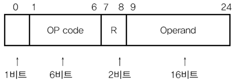

- [명령어](#명령어)
- [CPU](#cpu)
- [CPU 성능 향상 방법](#cpu-성능-향상-방법)
- [메모리](#메모리)

# 명령어
## 명령어란?
- 명령어는 데이터를 연산하게 만드는 코드다.
## 명령어 분류
- 명령어는 저수준 언어와 고수준 언어로 분류된다.

### 저급 언어란?
- 컴퓨터 친화적인 명령어다.
- 기게어(bit로 이루어진 명령어)와 어셈블리어(기계어와 일대일 대응이 되는 명령어)로 이루어져있다.
### 고급 언어란?
- 인간 친화적인 명령어다.

## 컴파일러와 인터프리터
- 그렇다면 컴퓨터는 고급 언어를 어떻게 기계어로 이해할까?
- 정답은 컴파일러와 인터프리터다. 컴파일러와 인터프리터가 고급언어 코드를 번역한다.

### 컴파일러
- 컴파일러는 소스 코드를 한 번에 기계어로 번역한다. 이때 오브젝트 코드가 생성되는데, 오브젝트 코드는 하나의 실행 파일이 될 수 없기 때문에 따로 링킹을 수행해야만 한다.

##### 장점
- 초기 스캔을 오래 걸리지만, 실행파일을 한 번 만들어 놓고 계속 사용하기 때문에 인터프리터보다 빠르다는 장점이 있다.
- 프로그램 실행 전에 오류를 발견할 수 있다.

##### 단점
- 초기 스캔이 오래 걸린다.
- 링킹 작업을 하기 때문에 인터프리터보다 메모리를 많이 사용한다.

### 인터프리터
- 소스 코드를 한줄씩 기계어로 번역한다.

##### 장점
- 소스 코드를 한줄씩 기계어로 번역하기 때문에 별도의 기계어 파일을 생성하지도 않고 링킹을 진행하지 않기 때문에 메모리 효율이 상대적으로 좋다.
- 빌드 과정 없이 실행이 가능하다.

##### 단점
- 한 문장씩 읽고 번역하기 때문에 실행 속도가 느리다.
- 한 문장씩 읽기 때문에 프로그램을 실행해야만 오류를 잡을 수 있다.

### 그렇다면 하나의 방식만 사용할까?
- 아니다. java도 JIT로 먼저 컴파일을 하여 속도를 줄이고 인터프리터를 이용하여 읽어들인다.

## 명령어 구조

- 명령어는 명령 코드와 오퍼랜드로 구분되어 있다.

### 명령코드(Operation Code)
- 명령어가 수행할 연산을 의마한다. 기본적인 명렁 코드는 4가지다.
- 데이터 전송, 산술/논리 연산, 제어 흐름 변경, 입출력 제어

### 오퍼랜드(Operand)
- 명령어가 연산에 수행할 데이터 혹은 데이터가 저장된 주소를 의마한다. 오퍼랜드 필드에는 데이터 또는 메모리나 레지스터 주소가 올 수 있다.
- 연산에 사용할 데이터 위치를 찾는, 주소 지정 방식
   - 즉시 주소 지정 방식(데이터)
   - 직접 주소 지정 방식(데이터 주소)
   - 간접 주소 지정 방식(유효 주소의 주소)
   - 레지스터 주소 지정 방식(데이터)
   - 레지스터 간접 주소 지정 방식(메모리의 주소가 레지스터에 저장)

* * *

# CPU
- ALU, 제어장치, 레지스터, 인터럽트에 대해서 이해하자

## ALU
- 레지스터를 통해 피연산자를 전달 받고 제어장치를 통해 해석된 연산을 전달받아, 결과를 레지스터에 저장하는 연산 장치다.
- ex) 1 + 2, 1과 2는 레지스터를 통해 전달받고 +는 제어장치를 통해 전달 받아 결과 3을 레지스터에 저장한다. (양수를 플래그에 등록한다.)

### 플래그 종류
- 부호 플래그 (1: 음수, 0:양수)
- 제로 플래그 (1: 0,   0:아님)
- 캐리 플래그 (1: 올림수, 발림수 0: 아님)
- 오버플로우 플래그 (1: 발생 0: 미발생)
- 인터럽트 플래그 (1: 인터럽트 가능 0: 불가능)
- 슈퍼바이저 플래그 (1: 커널모드 2:사용자모드)

## 제어장치
- 제어신호(write, read)를 내보내고 명령어를 해석하는 부품이다. 

### 제어장치가 받아들이고 내보내는 것들
##### 받아들이는 것 
- 제어장치는 클럭 신호를 받아들인다.
- 제어장치는 명령어 레지스터로부터 해석해야 할 명령어를 받아들인다.
- 제어장치는 플래그 레지스터 속 플래그 값을 받아들인다.
- 제어장치는 제어 신호를 받아들인다.
##### 내보내는 것
- 외부 : 제어신호를 메모리, 입출력장치로
- 내부 : 제어신호를 ALU, 레지스터로

## 레지스터
### 프로그램 카운터 (PC)
- 메모리에서 가져올 주소, 메모리에서 읽어들일 명령어의 주소를 저장하는 레지스터
- 명령어 포인터라고도 부른다.

### 명령어 레지스터
- 해석할 명령어를 저장하는 레지스터

### 메모리 주소 레지스터
- 메모리의 주소를 저장하는 레지스터
- 주소버스로 주소값을 내보낼 때 거친다.

### 메모리 버퍼(Or 데이터) 레지스터
- 메모리와 주고 받을 값을 저장하는 레지스터

### 범용 레지스터
- 데이터와 주소를 모두 저장할 수 있는 자유로운 레지스터

### 플래그 레지스터
- 연산 결과 또는 CPU의 부가정보를 저장하는 레지스터

#### 특정 레지스터를 이용한 주소 지정 방식
#### 스택 주소 지정 방식
- 스택과 스택 포인터를 이용한 주소 지정 방식
##### 스택 포인터
- 메모리의 스택 꼭대기를 지정하는 레지스
#### 변위 주소 지정 방식
- 오퍼랜드 필드 값과 레지스터 값을 더하여 유효주소를 얻어내는 방식
- 상대 주소 지정 방식 : 오퍼랜드 + PC = 유효주소
- 베이스 레지스터 주소 지정 방식 : 오퍼랜드 + 베이스 레지스터(기준 주소) = 유효주소

# 명령어 사이클과 인터럽트
- CPU가 명령어를 처리하는 것은 정형화된 흐름이 있다. 이를 명령어 사이클이라고 한다.
- 데이터를 인출하고 실행하는 과정을 기본적으로 거치나 간혹 흐름이 끊기는 경우가 있다. 바로 "인터럽트"다.
- 인출 사이클 - 실행 사이클 사이에 유효 주소의 주소를 얻어오는 과정(간접 사이클)이 필요하다.

## 인터럽트
- CPU가 수행 중인 작업이 방해를 받아 중지될 수 있는데 인터럽트가 발생한 경우다.
- 인터럽트는 크게 동기 인터럽트(예외)와 비동기 인터럽트(하드웨어 인터럽트)가 존재한다.
### 하드웨어 인터럽트
- 하드웨어 인터럽트는 입출력장치에 의해 발생하는 인터럽트다. 알림과 같은 역할을 한다.
- 예를 들어, 프린터에 출력을 명령했다고 가정하자. 인터럽트가 없다면 CPU는 프린트가 출력이 완료될 때까지 주기적으로 완료 여부를 확인해야만 한다. 이는 자원 낭비라 할 수 있다. 마치 알림이 없는 전자레인지 앞에서 조리가 끝날 때까지 기다리는 것과 같다. 하지만 하드웨어 인터럽트를 사용하면 출력이 완료되었을 때, CPU는 알람처럼 인터럽트를 통해 완료 여부를 확인할 수 있다.
#### 하드웨어 인터럽트 처리 과정
- 입출력장치는 CPU에 인터럽트를 요청한다.
- CPU는 실행 사이클이 끝나면 인터럽트 여부를 확인한다.
- CPU는 요청을 확인하고 인터럽트 플래그를 통해 처리 여부를 확인한다.
    - 물론 막을 수 없는 인터럽트도 있다. 정전이나 하드웨어 고장 등이 있다. 
- 인터럽트를 받아들일 수 있다면 CPU는 작업을 백업한다.
- CPU는 인터럽트 벡터(인터럽트 서비스 루틴 식별 정보)를 참조하여 인터럽트 서비스 루틴(=인터럽트 핸들러, 인터럽트를 처리하는 프로그램)을 실행한다.
- 루틴이 끝나면 백업된 작업을 처리한다.

### 동기 인터럽트(예외)의 종류
- 폴트 : 예외를 처리한 직후, 예외가 발생한 명령어부터 재실행하는 예외다.
  - 데이터가 메모리가 아니라, 보조기억장치에 있을 때 CPU는 폴트를 발생시키고 보조기억장로부터 필요한 데이터를 전달 받았을 때 다시 재개함
- 트랩 : 다음 명령어부터 실행을 재개하는 예외다.
  - ex) 디버깅
- 중단 : 프로그램을 강제로 중단 시켜야하는 오류가 발생했을 때
- 소프트웨어 인터럽트 : 시스템 호출이 발생했을 때

* * *

# CPU 성능 향상 방법
- 클럭, 코어, 쓰레드
- 파이프라이닝, 슈퍼스칼라, 비순차적 명령어 처리
- ISA, CISC, RISC

## 빠른 CPU를 위한 설계 기법

### 클럭
- [제어 장치가 받아들이는 것](#제어장치가-받아들이고-내보내는-것들)
- 클럭 속도가 높아질수록 CPU 명령어 싸이클이 빨라진다.
- 클럭 신호는 헤르츠(Hz) 단위로 측정한다.
- 클럭 속도는 일정하지 않으며 최대 클럭 속도로 끌어 올리는 행위를 오버클럭킹(overclocking)이라고 한다.
- 속도가 높으면 무조건 빠를까?
  - 빠른 속도는 발열 문제를 불러일으킨다.
  - 또한 클럭 속도로만 CPU의 속도를 증가시키는 건 한계가 있다.

### 코어
- 명렁어를 실행하는 부품이다.
- 코어가 발생한 다음부터, CPU의 정의를 흡수한다. 대신 CPU는 '명령어를 실행하는 부품의 집합'이 된다.
- 코어는 CPU의 부품인 ALU, 제어장치, 레지스터를 포함하고 있다. 코어가 8개라는 것은 이 부품들이 8개 포함되고 있다고 생각하면 된다.
- 코어를 여러개 포함하는 CPU를 멀티코어 프로세서라고 부른다.
- 코어가 많으면 무조건 빠를까?
  - 코어 수에 비례하여 증가하지 않는다. 업무가 균등하게 분배되어야 하기 때문이다.
  - 기억하자. 조별 과제를 4명이 한다고 4명만큼의 결과물이 발생하지 않는다.

### 스레드와 멀티스레드
- 하드웨어 스레드와 소프트웨어 스레드의 정의를 다르게 해야한다.
#### 하드웨어 스레드 
- 하나의 코어에서 처리하는 명령어 단위
- 하나의 코어로 여러개의 명령어를 처리하는 CPU를 멀티스레드 프로세서라고 한다.
- 하이퍼스레딩이라는 용어도 있다. 인텔의 멀티스레드 기술을 의미한다.

#### 소프트웨어 스레드
- 하나의 프로세스에서 독립적으로 실행되는 단위
  - 이때문에 1코어 1쓰레드 CPU로 여러 쓰레드로 만들어진 프로그램을 실행할 수 있다. 가 옳은 정의가 된다.

##### 멀티스레드 프로세서
- 멀티스레드 프로세서를 만드는 가장 큰 핵심은 **레지스터**다. 여러 명령어를 동시에 처리하려면 여러개의 레지스터를 가지고 있어야만 한다.
- 프로그램 입장에서 봤을 때 코어는 하나이지만 CPU가 여러개 있는 걸로 보인다. 그때문에 **논리 프로세서**라고 부르기도 한다.

## 명령어 병렬 처리 기법

### 파이프라인
- 명령어들을 명령어 파이프라인에 넣고 동시에 처리하는 기법이다.
- 하지만 파이프라인 위험을 가질 수 있다.

#### 파이프라인 위험
- 데이터 위험 : **데이터 의존성**에 의해 발생한다.
- 제어 위험 : **프로그램 카운터**의 갑작스러운 변화에 의해 발생한다.
- 구조적 위험 : 다른 명령어가 동시에 ALU, 레지스터 등과 같은 **CPU 부품을 사용할 때 발생**한다. **자원 위험**이라고도 부른다.

### 슈퍼스칼라
- CPU 내부에 여러개의 명령어 파이프라인을 포함한 구조다.
- 클럭 주기마다 여러개의 명령어를 인출할 수도, 실행할 수도 있다. 하지만 파이프라인 위험을 피하기가 더 까다롭다.

### 비순차적 명령어 처리
- 순차적으로 실행하지 않는 기법이다.
- 프로그램을 위에서 아래로 차례차례 실행하지 않고 순서를 바꿔도 무방한 명렁어를 먼저 실행하는 기법이다.

## CISC와 RISC

### ISA
- CPU가 이해하는 명령어 집합
- CPU마다 ISA가 다르기 때문에 같은 실행파일을 실행할 수 없다.
- 파이프라이닝 되기 쉬운 명령어 집합도 있고 그렇지 못한 명령어 집합도 있다.

### CISC
- **가변 길이 명령어**를 사용한다.
- 적은 수의 명령어로도 실행할 수 있기 때문에 메모리 공간을 절약할 수 있다.
- 명령어의 크기와 클럭 주기가 제각각이다. 그렇기 때문에 파이프라이닝이 어렵다.

### RISC
- 고정 길이 명령어를 사용한다.
- 명령어의 크기는 동일하고 클럭 주기는 1클럭로 실행된다. 그렇기 때문에 파이프라이닝에 최적화되어 있다.
- 하지만 레지스터를 이용하는 연산이 많고 레지스터 개수도 더 많다.
- 더 많은 명령으로 프로그램을 작동하기 때문에 메모리 공간을 상대적으로 더 사용한다.

* * *

# 메모리
- 메모리 특징, 성능과의 연관성, 메모리 종류
- 물리주소와 논리주소
- 캐시 메모리

## 메모리에 대해서
### 메모리 특징
- 실행되는 프로그램의 저장 공간이며 휘발성 특징을 가지고 있다.

### 메모리는 클수록 좋은가?
- 우선 메모리가 클수록 보조기억장치에 접근 빈도가 낮아지기 때문에 성능이 향상된다.
- 하지만 메모리는 저장 공간이기 때문에 메모리 공간에 비례해서 증가하지 않고 한계가 존재한다.

### 메모리 종류
#### DRAM(Dynamic RAM)
- 시간이 지날수록 데이터가 사라지는 메모리다.
- 집적성이 좋고 사용전력이 낮으며 비용이 저렴한 장점이 있다.
- 데이터의 소멸을 막기 위해 주기로 데이터를 재활성 해야만 한다.

#### SRAM(Static RAM)
- 시간이 지나도 데이터가 사라지지 않는 메모리다. (하지만 휘발성임)
- 집적성이 나쁘고 사용전력이 높으며 비용이 비싸다는 장점이 있다.
- 속도가 빠르기 때문에 캐시 메모리에서 사용된다.

#### SDRAM(Synchronous Dynamic RAM)
- 클럭 신호에 동기화된 RAM이다.
- 클럭 신호에 맞춰 CPU와 정보를 주고 받을 수 있는 DRAM이다.

#### DDR SDRAM(Double Data Rate RAM)
- 대역폭(데이터를 주고 받는 길의 너비)을 넓혀 속도를 빠르게 만든 SDRAM이다.
- SDRAM에 비해 2배 가량 빠르다.

## 물리 주소와 논리 주소
- 메모리가 사용하는 **물리 주소**와 CPU와 프로그램이 사용하는 **논리 주소**
- 예를 들어, 메모리에 카카오톡과 메모장 프로그램이 적재되어 있을 때 프로그램들은 메모리 몇번지에 저장되어 있는지 알 필요가 없다. **새로운 프로그램이 언제든 적재될 수 있고, 실행되지 않는 프로그램은 언제든 메모리에서 삭제**될 수 있기 때문이다.
- 그래서 0번지부터 시작하는 자신만의 논리 주소를 가지고 있다. 

### 메모리 관리 장치(MMU)
- 그렇다면 어떻게 카카오톡의 0번지와 메모장의 0번지를 구분할 수 있을까?
- CPU가 받아들이는 정보가 논리주소라고 해도 메모리와 상호작용 하기 위해서는 논리주소를 물리주소로 연산하는 과정이 필요하다.
- 논리주소를 물리주소로 연산해주는 장치가 메모리 관리 장치(MMU)다.

#### 물리주소를 연산하는 방법
[레지스터](#레지스터)
- 베이스 레지스터, 논리주소가 필요하다.
- 베이스 레지스터는 기준 주소라고 말했다. 이를 재정의해보자.
- 베이스 레지스터는 프로그램의 첫 물리 주소가 저장되는 공간이다.
```
(베이스 레지스터 + 논리 주소) = 물리 주소
```

#### 메모리를 보호하는 방법
- 한계 레지스터로 실행 중인 프로그램의 메모리를 보호한다.
- 논리주소의 최대값을 저장하는 레지스터로 요청된 논리주소가 한계 레지스터보다 크면 **인터럽트**가 발생한다.

## 캐시 메모리
### 저장 장치 계층 구조
- 캐시 메모리의 등장 배경을 이해하기 위해서는 저장 장치 계층 구조(memory hierarchy)의 이해가 필요하다.
- CPU에서 얼마나 가까운가를 계층적으로 표현한 것


출처 - https://www.geeksforgeeks.org/memory-hierarchy-design-and-its-characteristics/
- CPU와 가까운 저장 장치는 빠르고 멀리 있는 저장 장치는 느리다.
- 속도가 빠른 저장 장치는 용량이 작고 가격이 비싸다.

### 캐시 메모리
- CPU와 메모리 사이에 위치하고, 레지스터보다는 저장 공간이 크고 메모리 보다는 빠른 SRAM 기반의 저장 장치다.

### 캐시 메모리에 저장되는 것
- 캐시 메모리에는 메모리의 일부가 저장된다.
- CPU에서 사용할 법한 대상을 예측해서 저장해야 한다. 이때 나오는 개념이 캐시 히트, 캐시 미스, 캐시 적중률이다.
  - 캐시 히트 : 메모리 내 데이터를 CPU에서 활용하는 경우
  - 캐시 미스 : 메모리 내 데이터를 CPU에서 활용하지 않은 경우
  - 캐시 적중률 : 캐시 히트의 비율

### 참조 지역성의 원리
- CPU에 활용될법한 대상을 어떻게 알까?
- 바로 참조 지역성의 원리를 기반으로 저장할 데이터를 결정한다.
  - 시간 지역성 : CPU에서 최근에 접근했던 메모리 공간에 다시 접근하는 경향이 있다.
  - 공간 지역성 : CPU는 접근한 공간의 주변 메모리에 접근하려는 경향이 있다.
